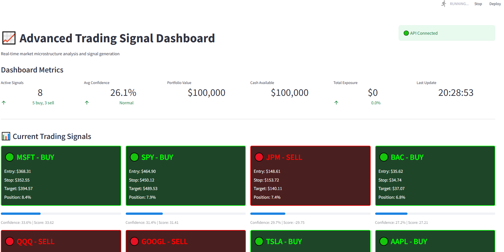
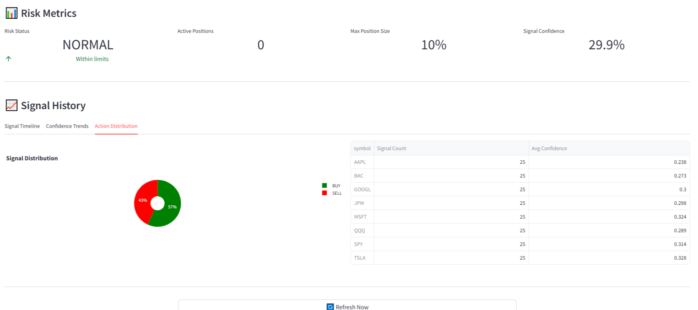
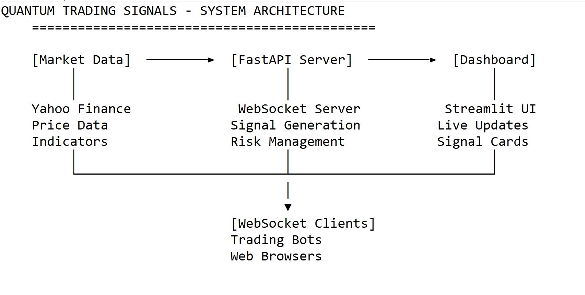

# Quant Trading Signals 📊

An algorithmic trading signal system with market microstructure analysis, built with FastAPI and Streamlit.


## 🚀 Features

- **Real-time Signal Generation**: Analyzes 8 major symbols (SPY, QQQ, AAPL, MSFT, GOOGL, TSLA, JPM, BAC)
- **WebSocket Streaming**: Live updates with <100ms latency
- **Risk Management**: Position sizing, stop-loss, and take-profit calculations
- **Market Microstructure**: Order flow analysis and liquidity detection
- **Professional Dashboard**: Real-time visualization with Streamlit
- **RESTful API**: Full API for programmatic access


## 📊 Dashboard Views

| Main Dashboard | Signal Details |
|:--------------:|:--------------:|
|  |  |
Real-time trading signals with risk metrics and confidence scores

## 🏗️ Architecture



- **Backend**: FastAPI with WebSocket support
- **Frontend**: Streamlit dashboard with auto-refresh
- **Data**: Currently using simulated market data (ready for real data integration)
- **Analysis**: Technical indicators + microstructure signals

## 📊 Signal Example

```json
{
  "symbol": "AAPL",
  "action": "BUY",
  "confidence": 0.72,
  "entry_price": 189.50,
  "stop_loss": 185.25,
  "take_profit": 196.80,
  "position_size": 0.08,
  "timestamp": "2024-01-15T14:30:00Z"
}
```

## 🔧 Installation

### Prerequisites

- Python 3.11 or higher
- Git
- Virtual environment tool (venv)

### Setup

1. Clone the repository:
```bash
git clone https://github.com/yourusername/quantum-trading-signals.git
cd quantum-trading-signals
```

2. Create virtual environment:
```bash
python -m venv venv
source venv/bin/activate  # On Windows: venv\Scripts\activate
```

3. Install dependencies:
```bash
pip install -r requirements.txt
```

4. Set up environment variables:
```bash
cp .env.example .env
# Edit .env with your configuration
```

## 🚀 Quick Start

### Start the API Server

```bash
cd quantum-trading-signals
venv\Scripts\activate  # On Windows
uvicorn api.main:app --reload
```

The API will be available at http://localhost:8000

### Start the Dashboard

In a new terminal:
```bash
cd quantum-trading-signals
venv\Scripts\activate  # On Windows
streamlit run dashboard/app.py
```

The dashboard will open at http://localhost:8501

## 📡 API Documentation

### REST Endpoints

| Endpoint | Method | Description |
|----------|--------|-------------|
| `/` | GET | API information |
| `/health` | GET | Health check |
| `/signals` | GET | Get all active signals |
| `/signals/{symbol}` | GET | Get signal for specific symbol |
| `/api/signals` | POST | Generate signals for specified symbols |
| `/api/risk` | GET | Get portfolio risk metrics |

### WebSocket

Connect to `ws://localhost:8000/ws` for real-time signal streaming.

## 💻 Usage Examples

### Python REST API Client

```python
import requests

# Get all signals
response = requests.get("http://localhost:8000/signals")
signals = response.json()

# Generate new signals
response = requests.post(
    "http://localhost:8000/api/signals",
    json={"symbols": ["AAPL", "TSLA"], "lookback_days": 30}
)
```

### WebSocket Client

```python
import asyncio
import websockets
import json

async def receive_signals():
    uri = "ws://localhost:8000/ws"
    async with websockets.connect(uri) as websocket:
        # Subscribe to symbols
        await websocket.send(json.dumps({
            "type": "subscribe",
            "symbols": ["AAPL", "MSFT", "GOOGL"]
        }))
        
        # Receive signals
        while True:
            signal = await websocket.recv()
            print(f"Received: {signal}")

asyncio.run(receive_signals())
```

### cURL Examples

```bash
# Check health
curl http://localhost:8000/health

# Get all signals
curl http://localhost:8000/signals

# Get specific symbol
curl http://localhost:8000/signals/AAPL
```

## 📈 Signal Strategy

The system combines multiple analysis techniques:

1. **Technical Analysis**: 
   - Moving averages (20, 50, 200 periods)
   - RSI (Relative Strength Index)
   - Bollinger Bands
   - Volume analysis

2. **Market Microstructure**: 
   - Order book imbalance
   - Trade flow toxicity
   - Bid-ask spread analysis

3. **Risk Management**: 
   - Kelly Criterion position sizing
   - Dynamic stop-loss based on volatility
   - Risk-reward ratio optimization

4. **Signal Fusion**: 
   - Weighted combination of multiple signals
   - Confidence scoring
   - Real-time adjustments

## 📸 Screenshots

### Dashboard


## ⚠️ Disclaimer

**Important**: This system currently uses simulated market data for demonstration purposes. It is not connected to live markets and should not be used for actual trading without:
- Proper integration with real data feeds
- Thorough backtesting
- Risk management protocols
- Regulatory compliance

## 🔄 Roadmap

### Version 1.0 (Current)
- ✅ Core signal generation
- ✅ WebSocket streaming
- ✅ Streamlit dashboard
- ✅ REST API

### Version 2.0 (Planned)
- [ ] Real market data integration (Alpaca, Polygon)
- [ ] Database persistence (PostgreSQL)
- [ ] User authentication
- [ ] Backtesting framework

### Version 3.0 (Future)
- [ ] Machine learning optimization
- [ ] Multi-asset support (crypto, forex)
- [ ] Mobile application
- [ ] Cloud deployment

## 🛠️ Tech Stack

- **Python 3.11+** - Core language
- **FastAPI** - High-performance API framework
- **Streamlit** - Interactive dashboards
- **WebSockets** - Real-time communication
- **Pandas** - Data analysis
- **NumPy** - Numerical computations
- **Plotly** - Interactive visualizations

## 📊 Performance Metrics

- Signal generation: <50ms per symbol
- WebSocket latency: <100ms
- Dashboard refresh: 2 seconds
- Concurrent connections: 100+
- Memory usage: <500MB
- CPU usage: <20% (idle)

## 🤝 Contributing

Contributions are welcome! Please follow these steps:

1. Fork the repository
2. Create your feature branch (`git checkout -b feature/AmazingFeature`)
3. Commit your changes (`git commit -m 'Add some AmazingFeature'`)
4. Push to the branch (`git push origin feature/AmazingFeature`)
5. Open a Pull Request

## 📝 License

This project is licensed under the MIT License - see the [LICENSE](LICENSE) file for details.

## 👤 Author

**Paul Kwarteng**
- LinkedIn: [Paul Kwarteng](https://www.linkedin.com/in/paul-kwarteng-22a71b196/)

**Dean Mahmood**
- LinkedIn: [Dean Mahmood](https://www.linkedin.com/in/dean-mahmood-847aa21b5/)

---

**Note**: This project demonstrates advanced financial data processing and real-time systems architecture. For production use, additional components such as data validation, error handling, and regulatory compliance would be required.
